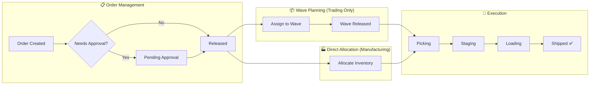

# Outbound Module - Complete Testing Guide

> **Purpose**: This guide walks you through the entire outbound workflow from business and software perspectives, with step-by-step testing scenarios.

---

## Table of Contents
1. [Business Workflow Overview](#1-business-workflow-overview)
2. [Software Architecture](#2-software-architecture)
3. [Node-RED Setup](#3-node-red-setup)
4. [Testing Scenarios](#4-testing-scenarios)
5. [Compatibility Notes](#5-compatibility-notes)

---

## 1. Business Workflow Overview

### The Outbound Journey (What Happens in Real Life)



### When to Use Each Page

| Page | Role | When to Use |
|------|------|-------------|
| **Outbound Orders** | Planner / Supervisor | Create, approve, hold/release orders |
| **Wave Planning** | Planner (Trading) | Group orders by carrier/route for efficient picking |
| **Outbound Execution** | Warehouse Operator | Execute picks, stage items, load trucks |

---

## 2. Software Architecture

### Frontend Pages & Routes

| Page | Route | Component |
|------|-------|-----------|
| Orders | `/operations/outbound/orders` | `OutboundOrders.jsx` |
| Waves | `/operations/outbound/waves` | `WavePlanning.jsx` |
| Execution | `/operations/outbound/execution` | `OutboundExecution.jsx` |

### MQTT Topic Map

```
Henkelv2/Shanghai/Logistics/Outbound/
├── State/
│   ├── DN_Workflow      ← OutboundOrders subscribes
│   ├── Wave_List        ← WavePlanning subscribes
│   ├── Picking_Queue    ← Execution (Picking tab) subscribes
│   ├── Staging_Area     ← Execution (Staging tab) subscribes
│   └── Loading_Docks    ← Execution (Loading tab) subscribes
└── Action/
    ├── Create_Order     ← OutboundOrders publishes
    ├── Hold_Order       ← OutboundOrders publishes
    ├── Release_Hold     ← OutboundOrders publishes
    ├── Add_To_Wave      ← OutboundOrders publishes
    ├── Remove_From_Wave ← OutboundOrders publishes
    ├── Allocate_DN      ← OutboundOrders publishes
    ├── Create_Wave      ← WavePlanning publishes
    ├── Release_Wave     ← WavePlanning publishes
    ├── Confirm_Pick     ← Execution publishes
    └── Report_Short     ← Execution publishes
```

---

## 3. Node-RED Setup

### Importing Mock Data Generators

1. Open Node-RED at `http://localhost:1880`
2. Click ☰ Menu → **Import**
3. Select file: `nodered/outbound_mock_data_generators.json`
4. Click **Import** → **Deploy**

### Using the Mock Generators

After import, you'll see a yellow group called **🧪 Mock Data Generators**.

| Inject Node | What It Does | When to Click |
|-------------|--------------|---------------|
| 🔄 DN_Workflow | Generates 3-5 random orders | Before testing Orders page |
| 🔄 Wave_List | Generates 2-4 random waves | Before testing Waves page |
| 🔄 Picking_Queue | Generates 5-10 pick tasks | Before testing Picking tab |
| 🔄 Staging_Area | Populates staging zones | Before testing Staging tab |
| 🔄 Loading_Docks | Sets up dock statuses | Before testing Loading tab |

> **Key**: These are **not** one-time. Click them anytime to refresh data!

### Connecting to Existing Backend

The mock generators connect to the same MQTT broker (`a749d056cff1a785`) as your existing Outbound Module V2. They:
- Store data in global context (`outbound_dn_db`, `wave_db`, etc.)
- Your action handlers (Hold, Release, Wave, Allocate) read from these same globals
- No conflicts!

---

## 4. Testing Scenarios

### Scenario 1: Trading Context - Full Wave Flow

**Business Context**: Trading company ships goods to external customers. Orders are grouped into waves for carrier pickup.

#### Step-by-Step:

1. **Generate Mock Orders**
   - In Node-RED, click **🔄 DN_Workflow**
   - Open browser: `http://localhost:5173/operations/outbound/orders`
   - Verify orders appear with various statuses

2. **Put Order on Hold**
   - Click any order with status `RELEASED`
   - In action sheet, click **Hold Order**
   - Enter reason → Confirm
   - Status changes to `ON_HOLD`
   - Check Node-RED debug panel for published message

3. **Release Hold**
   - Click the `ON_HOLD` order
   - Click **Release Hold**
   - Status returns to `RELEASED`

4. **Assign to Wave**
   - Click a `RELEASED` order
   - Click **Add to Wave**
   - Enter wave ID or create new
   - Status changes to `WAVE_ASSIGNED`
   - Wave column shows the assignment

5. **Manage Waves**
   - Navigate to `/operations/outbound/waves`
   - Click **🔄 Wave_List** in Node-RED first
   - See wave cards with progress indicators
   - Click **Create Wave** → Fill form → Create
   - Click **Release Wave** to trigger allocation

6. **Execute Picking**
   - Navigate to `/operations/outbound/execution`
   - Click **🔄 Picking_Queue** in Node-RED
   - See pick tasks in Picking tab
   - Click task → **Start Pick** → **Confirm Pick**

7. **Monitor Staging**
   - Click **Staging** tab
   - Click **🔄 Staging_Area** in Node-RED
   - See staging zones with items

8. **Load Truck**
   - Click **Loading** tab
   - Click **🔄 Loading_Docks** in Node-RED
   - See dock status (Available/Waiting/Loading)

---

### Scenario 2: Manufacturing Context - Direct Allocation

**Business Context**: Manufacturing plant delivers materials directly to production lines. No waves needed.

#### Step-by-Step:

1. **Create Material Issue Order**
   - On Orders page, click **Create Order**
   - Type: `TRANSFER_OUT`
   - Destination: `PRODUCTION-LINE-A`
   - Add materials with quantities
   - Submit

2. **Direct Allocate**
   - Click the new order
   - Click **Allocate** (not Add to Wave)
   - Backend runs FEFO allocation
   - Pick tasks created targeting production line

3. **Execute & Deliver**
   - Pick materials from storage
   - Confirm picks
   - Confirm delivery to production line

---

### Scenario 3: Exception Handling - Short Pick

**Business Context**: Picker finds less inventory than allocated (system vs reality mismatch).

1. Start a pick task
2. Click **Report Short**
3. Enter actual quantity found
4. System creates exception
5. Triggers recount / inventory adjustment

---

## 5. Compatibility Notes

### ✅ Compatible with WORKFLOWS.md

| Document State | Implementation |
|----------------|----------------|
| `NEW` | ✅ Supported |
| `PENDING_APPROVAL` | ✅ Via status update |
| `APPROVED` | ✅ Supported |
| `RELEASED` | ✅ Supported (enterprise addition) |
| `ON_HOLD` | ✅ Supported (enterprise addition) |
| `WAVE_ASSIGNED` | ✅ Supported (enterprise addition) |
| `ALLOCATED` | ✅ Via Allocate_DN action |
| `PICKING` | ✅ Supported |
| `PACKING` | ✅ Supported |
| `READY_TO_SHIP` | ✅ Supported |
| `SHIPPED` | ✅ Terminal state |

### ✅ Compatible with BUSINESS_RULES.md

| Rule | Implementation |
|------|----------------|
| ALLOC-001 (FEFO) | ✅ `func_wave_release` uses FEFO sort |
| ALLOC-006 (Status) | ✅ Only `AVAILABLE` inventory allocated |
| DOC-002 (Edit Lock) | ✅ UI disables actions based on status |
| DOC-003 (Cancel) | ✅ Only pre-PICKING orders can be held |

### ✅ Compatible with DOMAIN_MODEL.md

| Entity | Implementation |
|--------|----------------|
| OutboundOrder | ✅ `dn_no`, `type`, `status`, `lines[]`, `customer`, `destination` |
| Task | ✅ Pick tasks with `task_id`, `status`, `material_code`, `from_loc`, `to_loc` |
| Wave | ✅ `wave_id`, `status`, `delivery_ids[]`, `picks_total`, `picks_completed` |

---

## Quick Reference Card

### Frontend Actions → Backend Topic

| User Action | MQTT Topic Published |
|-------------|---------------------|
| Create Order | `Action/Create_Order` |
| Hold Order | `Action/Hold_Order` |
| Release Hold | `Action/Release_Hold` |
| Add to Wave | `Action/Add_To_Wave` |
| Remove from Wave | `Action/Remove_From_Wave` |
| Allocate | `Action/Allocate_DN` |
| Create Wave | `Action/Create_Wave` |
| Release Wave | `Action/Release_Wave` |
| Confirm Pick | `Action/Confirm_Pick` |
| Report Short | `Action/Report_Short_Pick` |

### Backend State → Frontend Subscription

| Node-RED Publishes | Frontend Subscribes |
|-------------------|---------------------|
| `State/DN_Workflow` | OutboundOrders |
| `State/Wave_List` | WavePlanning |
| `State/Picking_Queue` | Execution - Picking |
| `State/Staging_Area` | Execution - Staging |
| `State/Loading_Docks` | Execution - Loading |

---

## Troubleshooting

| Issue | Solution |
|-------|----------|
| Page shows empty | Click mock generator inject node in Node-RED |
| Action not working | Check Node-RED debug panel for errors |
| MQTT not connecting | Verify EMQX is running on port 1883 |
| Data not updating | Ensure `retain: true` on MQTT out nodes |
