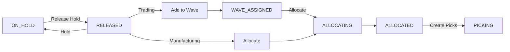

# Phase A Complete: OutboundOrders Enterprise Upgrade

## Overview
Upgraded `OutboundOrders.jsx` from legacy status machine to enterprise outbound workflow.

## Changes Made

### 1. New MQTT Topics
Added 6 enterprise action topics for real-time workflow:
```javascript
TOPIC_HOLD_ORDER = "Henkelv2/.../Action/Hold_Order"
TOPIC_RELEASE_HOLD = "Henkelv2/.../Action/Release_Hold"
TOPIC_ADD_TO_WAVE = "Henkelv2/.../Action/Add_To_Wave"
TOPIC_REMOVE_FROM_WAVE = "Henkelv2/.../Action/Remove_From_Wave"
TOPIC_ALLOCATE_DN = "Henkelv2/.../Action/Allocate_DN"
TOPIC_DN_STATE = "Henkelv2/.../State/DN_Workflow"
```

### 2. Action Handlers
| Handler | Description | MQTT Topic |
|---------|-------------|------------|
| `handleHoldOrder()` | Put order on hold with optional reason | Hold_Order |
| `handleReleaseHold()` | Release held order back to RELEASED | Release_Hold |
| `handleAddToWave()` | Add order to wave (Trading only) | Add_To_Wave |
| `handleRemoveFromWave()` | Remove order from wave | Remove_From_Wave |
| `handleAllocate()` | Trigger inventory allocation | Allocate_DN |

### 3. Context-Aware Action Sheet
The action sheet now shows different actions based on status AND order type:



### 4. UI Enhancements
- **Wave Column**: Shows wave assignment with indigo badge
- **Status Filter**: 13 enterprise statuses (RELEASED, ON_HOLD, ALLOCATED, etc.)
- **Wave Input**: Inline input for wave assignment in action sheet

### 5. Files Modified

render_diffs(file:///d:/henkel-wms-v2/src/modules/outbound/pages/OutboundOrders.jsx)

## Verification
- ✅ Build passed: `vite build` completed in 7.72s
- ✅ No TypeScript/ESLint errors
- ✅ Domain layer already enterprise-ready (no changes needed)

## Next Steps
1. **Phase B**: Create [WavePlanning.jsx](file:///d:/henkel-wms-v2/src/modules/outbound/pages/WavePlanning.jsx) 
2. **Phase C**: Create [OutboundExecution.jsx](file:///d:/henkel-wms-v2/src/modules/outbound/pages/OutboundExecution.jsx) with tabs
