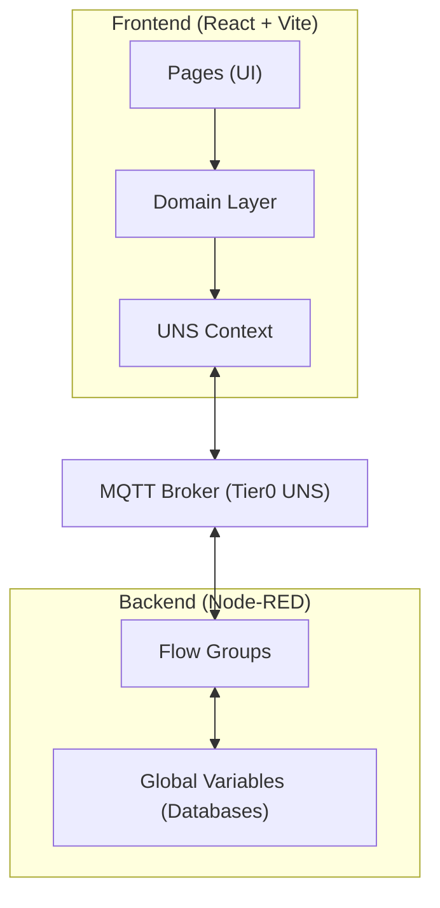
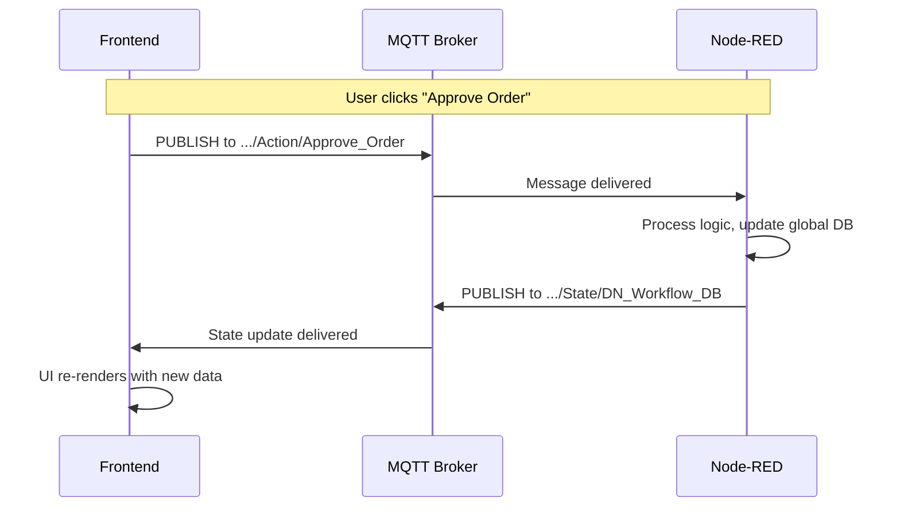

# WMS Architecture Overview

This document explains how the Henkel WMS system is structured so you can understand how the pieces fit together.

---

## The Big Picture



**Key Insight**: Your system uses **MQTT** (a message queue) instead of REST APIs. This means:
- **No request/response** - You publish a message and subscribe to state changes
- **Real-time updates** - When data changes, all subscribers get notified immediately
- **Topic-based routing** - Topics like `Henkelv2/Shanghai/.../Action/Approve` route messages

---

## Frontend Architecture

### Layer 1: Pages (What Users See)

```
src/modules/
├── outbound/pages/       # 12 pages for outbound orders
├── inbound/pages/        # 5 pages for receiving/putaway
├── production/pages/     # 7 pages for manufacturing
├── quality/pages/        # 4 pages for QC/QA
├── master/pages/         # 12 pages for master data
├── inventory/pages/      # 1 page for stock view
├── dashboard/pages/      # 3 pages for KPIs
├── finance/pages/        # 4 pages for costing
├── integration/pages/    # 2 pages for 3PL sync
├── governance/pages/     # 2 pages for audit/trace
├── reports/pages/        # 1 page for reports
└── admin/pages/          # 1 page for users
```

**Each page does 3 things:**
1. **Subscribe** to State topics to get data
2. **Display** that data using UI components
3. **Publish** to Action topics when user clicks buttons

### Layer 2: Domain Layer (Business Logic)

```
src/domain/
├── outbound/
│   ├── OutboundOrderValidator.js   # Validation & status checks
│   └── OutboundOrderService.js     # MQTT payload builders
├── inbound/
│   ├── InboundOrderValidator.js
│   ├── PutawayTaskValidator.js
│   └── ExceptionValidator.js
├── material/
│   └── MaterialValidator.js
└── location/
    └── LocationValidator.js
```

**The domain layer has two types of files:**

| File Type | Purpose | Example Methods |
|-----------|---------|-----------------|
| **Validator** | Check business rules, validate data | `isPendingApproval()`, `validateStatusTransition()`, `collectCreateErrors()` |
| **Service** | Build MQTT payloads, normalize data | `buildApproveCommand()`, `normalizeOrder()`, `filterOrdersByStatus()` |

**Why this matters**: Business logic lives in ONE place, not scattered across pages.

### Layer 3: Context (MQTT Connection)

```
src/context/
└── UNSContext.jsx    # Manages MQTT connection & subscriptions
```

**The UNSContext provides:**
- `data.raw[topicName]` - Raw data from any subscribed topic
- `publish(topic, payload)` - Send commands to Node-RED
- `status` - Connection status

---

## MQTT Topic Structure

### The Pattern

```
Henkelv2/Shanghai/Logistics/{Module}/{SubModule}/{Type}/{Entity}
```

| Part | Values | Purpose |
|------|--------|---------|
| Module | `Internal`, `External`, `MasterData`, `Production`, `Outbound` | High-level domain |
| SubModule | `Ops`, `Quality`, `Costing`, etc. | Specific area |
| Type | **`State`** or **`Action`** | Direction of data |
| Entity | `DN_Workflow_DB`, `Inventory_Level`, etc. | The actual data |

### State vs Action Topics



**Rule**: 
- Subscribe to **State** topics (read data)
- Publish to **Action** topics (trigger operations)

### Key Topics Map

| Frontend Module | State Topic (Subscribe) | Action Topic (Publish) |
|-----------------|------------------------|------------------------|
| Outbound Orders | `Henkelv2/Shanghai/Logistics/Costing/State/DN_Workflow_DB` | `Henkelv2/Shanghai/Logistics/Outbound/Action/Approve_Order` |
| Inventory | `Henkelv2/Shanghai/Logistics/Internal/Ops/State/Inventory_Level` | (via other actions) |
| Inbound Tasks | `Henkelv2/Shanghai/Logistics/Internal/Ops/State/Task_Queue` | `Henkelv2/Shanghai/Logistics/Internal/Ops/Action/Confirm_Putaway` |
| QC Queue | `Henkelv2/Shanghai/Logistics/Internal/Quality/State/Inspection_Queue` | `Henkelv2/Shanghai/Logistics/Internal/Quality/Action/Submit_Result` |
| Master Materials | `Henkelv2/Shanghai/Logistics/MasterData/State/Materials` | `Henkelv2/Shanghai/Logistics/MasterData/Action/Update_Material` |
| Production Orders | `Henkelv2/Shanghai/Logistics/Production/State/Order_List` | `Henkelv2/Shanghai/Logistics/Production/Action/Create_Order` |

---

## Node-RED Backend Architecture

### How It's Organized

Your Node-RED flow has **groups** that organize related logic:

| Group Name | Purpose | Key Globals Modified |
|------------|---------|---------------------|
| **Initialization** | Seeds demo data on startup | `master_materials`, `master_locations`, etc. |
| **Master Data Management** | CRUD for master data | `master_materials`, `master_locations`, etc. |
| **Internal Inbound** | Receiving, Putaway, QC | `internal_task_queue`, `internal_stock_list`, `qc_queue` |
| **Production Supply** | Reservations, Picking, Staging | `reservation_db`, `picking_task_db`, `production_order_db` |
| **Internal Outbound** | Shipment creation, Pick/Pack/Ship | `outbound_shipment_db`, `internal_stock_list` |
| **Governance** | Audit logging, Traceability | `audit_log_db` |

### The Pattern: Every Node-RED Flow

```
[MQTT In] → [Function Node] → [MQTT Out]
   ↓              ↓               ↓
 Topic:       1. Get global      Topic:
 .../Action/...  2. Process      .../State/...
              3. Update global
              4. Build UNS payload
```

### Global Variables = Your Databases

Node-RED uses `global.get()` and `global.set()` as in-memory databases:

| Global Variable | Contains | Used By |
|-----------------|----------|---------|
| `master_materials` | Material master data | Inbound, Production, Master Pages |
| `master_locations` | Location master data | Putaway, Inbound Pages |
| `internal_stock_list` | Current inventory | Inventory Page, All Movements |
| `internal_task_queue` | Putaway tasks | Inbound Putaway Page |
| `qc_queue` | QC inspection queue | Quality Control Page |
| `decision_queue` | QA approval queue | QA Decisions Page |
| `production_order_db` | Production orders | Production Orders Page |
| `reservation_db` | Material reservations | Production Reservations Page |
| `picking_task_db` | Picking tasks | Production Picking Page |
| `outbound_shipment_db` | Outbound shipments | Outbound Shipment Page |
| `audit_log_db` | Audit trail | Audit Log Page |

---

## Data Flow Example: Approve an Order

Let's trace what happens when a user approves an outbound order:

### Step 1: Frontend (Page)
```javascript
// In OutboundOrderDetail.jsx or DnApproval.jsx
import { OutboundOrderService } from '@/domain/outbound/OutboundOrderService';

const handleApprove = () => {
  const payload = OutboundOrderService.buildApproveCommand(orderId);
  publish('Henkelv2/Shanghai/Logistics/Outbound/Action/Approve_Order', payload);
};
```

### Step 2: Frontend (Domain Service)
```javascript
// In OutboundOrderService.js
static buildApproveCommand(orderId) {
  OutboundOrderValidator.validateApprovalAction(orderId, currentStatus);
  return {
    dn_no: orderId,
    action: 'APPROVE',
    operator: 'current_user',
    timestamp: Date.now()
  };
}
```

### Step 3: Node-RED (Function)
```javascript
// In Node-RED Approve Order function
let dnDB = global.get('dn_workflow_db') || { items: [] };

// Find and update order
let order = dnDB.items.find(o => o.dn_no === msg.payload.dn_no);
order.status = 'APPROVED';

// Save and republish
global.set('dn_workflow_db', dnDB);
msg.topic = 'Henkelv2/Shanghai/Logistics/Costing/State/DN_Workflow_DB';
msg.payload = { version: "1.0", topics: [{ path: msg.topic, type: "state", value: dnDB }] };
return msg;
```

### Step 4: Frontend (Auto-Update)
The UNS Context is subscribed to the State topic. When the new state arrives:
1. `data.raw['...DN_Workflow_DB']` updates
2. React components using this data re-render
3. UI shows the order as "APPROVED"

---

## Key Patterns to Remember

### 1. The "UNS Envelope" Pattern
All MQTT payloads follow this structure:
```javascript
{
  version: "1.0",
  topics: [{
    path: "Henkelv2/Shanghai/...",
    type: "state",  // or "action"
    value: { /* actual data */ }
  }]
}
```

Your frontend code must unwrap this envelope to get the actual data.

### 2. The Validator + Service Pattern
```javascript
// ALWAYS use Validator for checks
if (OutboundOrderValidator.isPendingApproval(order.status)) {
  // Show approve button
}

// ALWAYS use Service for MQTT payloads
const payload = OutboundOrderService.buildApproveCommand(orderId);
```

### 3. The State Machine Pattern
Orders follow defined status transitions. See `docs/WORKFLOWS.md` for all state machines.

```
NEW → PENDING_APPROVAL → APPROVED → PICKING → PACKING → SHIPPED
                       ↘ REJECTED
```

Invalid transitions (e.g., NEW → SHIPPED) are blocked by validators.

---

## File Reference Quick Guide

| When Working On | Read These Files First |
|-----------------|------------------------|
| Any new feature | `docs/PRD.md`, `docs/WORKFLOWS.md` |
| Outbound module | `docs/UI_PAGES.md` (Outbound section), `src/domain/outbound/*.js` |
| Inbound module | `docs/UI_PAGES.md` (Inbound section), `src/domain/inbound/*.js` |
| MQTT topics | `docs/MQTT_CONTRACT.md` |
| Business rules | `docs/BUSINESS_RULES.md` |
| Edge cases | `docs/EDGE_CASES.md` |
| Node-RED | (Open in browser at localhost:1880) |

---

## Next Steps

See `CHANGE_IMPACT_GUIDE.md` for understanding what to change when implementing new features.
