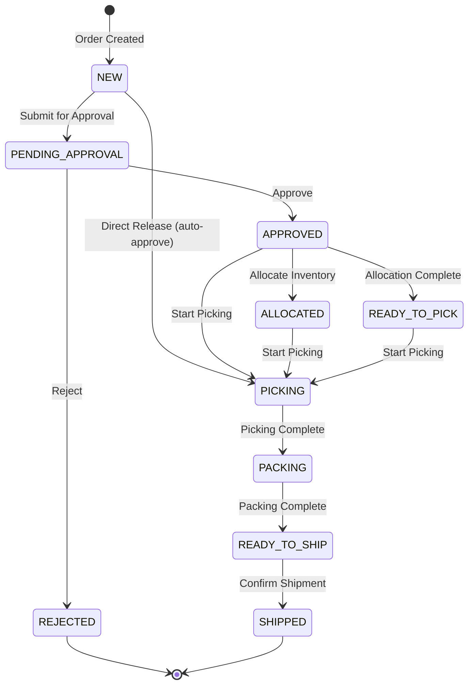
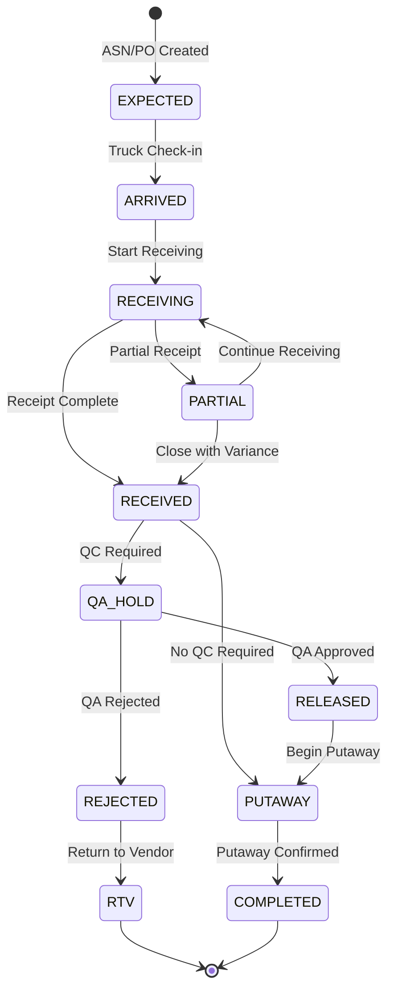
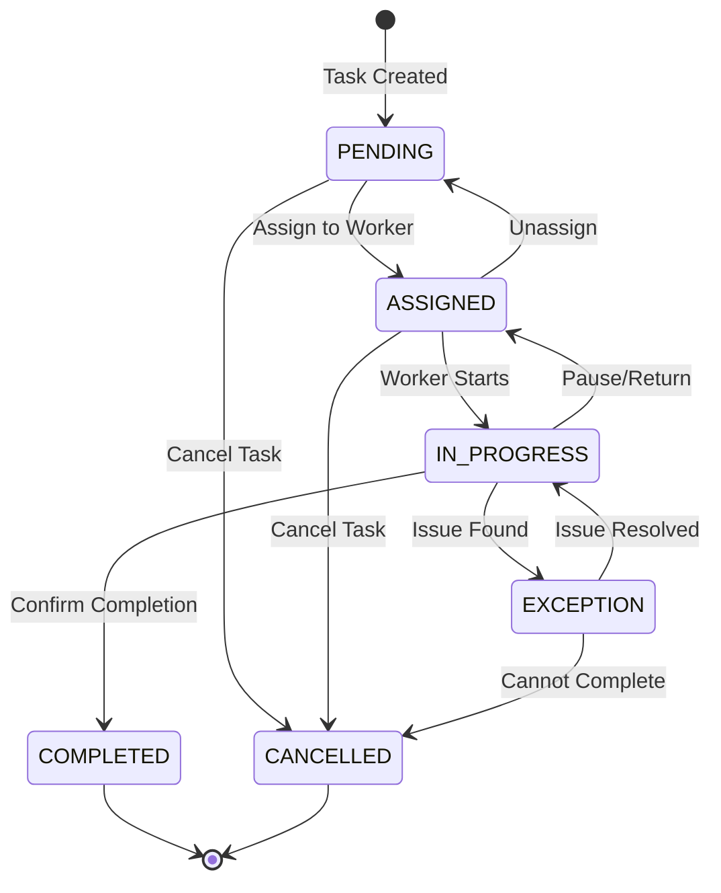
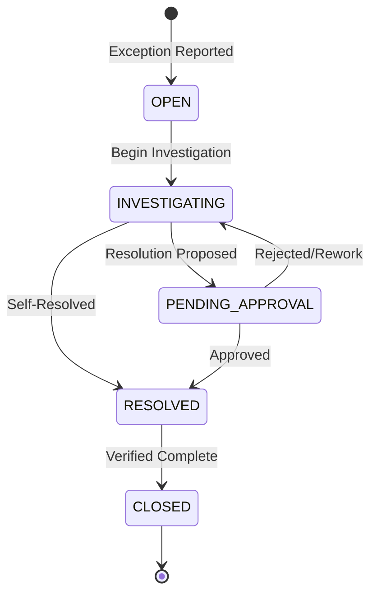
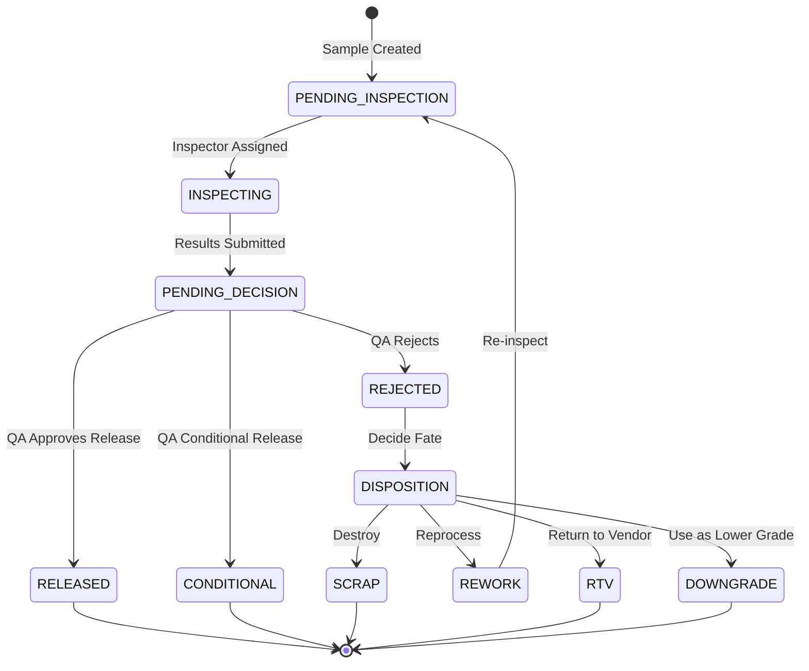

# WMS Workflows and State Machines

This document defines the canonical workflows and valid state transitions for all WMS processes.

---

## 1. Outbound Order Workflow

### 1.1 State Machine Diagram



### 1.2 Status Transition Table

| From | To | Guard Condition | Required Data | Action |
|------|----|-----------------|---------------|--------|
| `NEW` | `PENDING_APPROVAL` | Order valid | - | Submit for review |
| `NEW` | `PICKING` | Auto-approve enabled | - | Skip approval |
| `PENDING_APPROVAL` | `APPROVED` | User has approval permission | - | Release for execution |
| `PENDING_APPROVAL` | `REJECTED` | User has approval permission | `reason` | Record rejection |
| `APPROVED` | `ALLOCATED` | Inventory check started | - | Begin allocation |
| `APPROVED` | `READY_TO_PICK` | Allocation successful | - | Ready for picking |
| `APPROVED` | `PICKING` | Direct pick start | - | Create pick tasks |
| `ALLOCATED` | `PICKING` | Allocation confirmed | - | Create pick tasks |
| `READY_TO_PICK` | `PICKING` | Tasks assigned | - | Begin pick execution |
| `PICKING` | `PACKING` | All items picked | `picked_qty` per line | Move to pack station |
| `PACKING` | `READY_TO_SHIP` | All items packed | `packed_qty` per line | Ready for shipment |
| `READY_TO_SHIP` | `SHIPPED` | Carrier confirmed | `carrier`, `tracking_number` | Goods issue posted |

### 1.3 Workflow Phases (Detailed)

#### Phase 0: Demand Signal
- **Trigger**: Sales order, transfer request, or production issue demand
- **Output**: OutboundOrder created with status `NEW`

#### Phase 1: Validation & Release Control
- **Trigger**: User submits order
- **Checks**: 
  - Master data valid (materials, UoM, customer)
  - All required fields present
  - Lines have valid quantities
- **Output**: Status → `PENDING_APPROVAL` or `APPROVED` (if auto-approve)

#### Phase 2: Planning (Wave/Batch)
- **Trigger**: Order approved
- **Decisions**:
  - Wave grouping (carrier, route, ship date)
  - Pick method (discrete, cluster, batch, zone)
  - Resource allocation
- **Output**: Wave/batch plan created

#### Phase 3: Allocation
- **Trigger**: Order released for picking
- **Rules**:
  - FEFO/FIFO based on material settings
  - Status eligibility (only `AVAILABLE` inventory)
  - Lot/serial constraints
  - Location preferences (pick face first)
- **Output**: Inventory reserved, status → `ALLOCATED`

#### Phase 4: Pick Execution
- **Trigger**: Pick task assigned to operator
- **Operations**:
  - Scan location → scan HU/material → confirm qty
  - Handle short pick → create exception
  - Capture serial numbers if required
- **Output**: Inventory moved to picked state, status → `PICKING` → `PACKING`

#### Phase 5: Packing
- **Trigger**: Picking complete
- **Operations**:
  - Cartonization
  - Label printing (GS1/SSCC, customer labels)
  - Weight/dimension capture
  - Pack verification scan
- **Output**: Packed HUs created, status → `READY_TO_SHIP`

#### Phase 6: Shipping
- **Trigger**: Load confirmed
- **Operations**:
  - Carrier handoff
  - Seal capture
  - Manifest generation
  - Goods issue posting to ERP
- **Required**: `carrier`, `tracking_number`
- **Output**: Status → `SHIPPED` (terminal)

---

## 2. Inbound Order Workflow

### 2.1 State Machine Diagram



### 2.2 Status Transition Table

| From | To | Guard Condition | Required Data | Action |
|------|----|-----------------|---------------|--------|
| `EXPECTED` | `ARRIVED` | Truck at dock | `dock_door` | Gate check-in |
| `ARRIVED` | `RECEIVING` | Unload started | - | Begin receipt process |
| `RECEIVING` | `RECEIVED` | All lines received | `received_qty` per line | Receipt complete |
| `RECEIVING` | `PARTIAL` | Some lines incomplete | `received_qty` | Partial receipt |
| `PARTIAL` | `RECEIVING` | More goods arriving | - | Continue receiving |
| `PARTIAL` | `RECEIVED` | Accept variance | `reason_code` | Close with exception |
| `RECEIVED` | `QA_HOLD` | QC required for material/supplier | - | Move to quarantine |
| `RECEIVED` | `PUTAWAY` | No QC required | - | Direct to storage |
| `QA_HOLD` | `RELEASED` | QA inspection passed | `inspector`, `result` | Release inventory |
| `QA_HOLD` | `REJECTED` | QA inspection failed | `inspector`, `reason` | Block inventory |
| `RELEASED` | `PUTAWAY` | Location available | - | Create putaway tasks |
| `PUTAWAY` | `COMPLETED` | All items putaway | `target_location` per HU | Inbound complete |
| `REJECTED` | `RTV` | Return approved | `rtv_number` | Return to vendor |

### 2.3 Workflow Phases (Detailed)

#### Phase 0: Supply Signal
- **Sources**: PO, ASN, Transfer In, Production Receipt, RMA
- **Output**: InboundOrder created with status `EXPECTED`

#### Phase 1: Gate Check-in
- **Trigger**: Truck arrives at facility
- **Operations**:
  - Dock appointment verification
  - Carrier/vehicle info capture
  - Seal check, paperwork check
- **Output**: Status → `ARRIVED`

#### Phase 2: Receiving
- **Trigger**: Unload begins
- **Operations**:
  - Scan supplier labels or create HU/LPN
  - Capture mandatory attributes (lot, serial, expiry, CoO)
  - Record received quantities
  - Weight/dimension check if required
- **Output**: Status → `RECEIVING` → `RECEIVED` or `PARTIAL`

#### Phase 3: Verification/Matching
- **Trigger**: Receipt quantities recorded
- **Checks**:
  - 3-way match (ASN vs PO vs Physical)
  - Attribute validation
  - Tolerance check (over/short within limits)
- **Output**: Clean receipt or exception created

#### Phase 4: Quality Gate
- **Trigger**: QC required by material/supplier policy
- **Operations**:
  - Move to quarantine zone
  - Perform inspection (sampling, visual, test)
  - Record results with evidence
  - Disposition decision
- **Output**: Status → `QA_HOLD` → `RELEASED` or `REJECTED`

#### Phase 5: Putaway
- **Trigger**: Inventory released for storage
- **Operations**:
  - System recommends location (based on constraints)
  - Operator scans source + destination
  - Confirm putaway
- **Output**: Inventory at final location, status → `COMPLETED`

---

## 3. Task Workflow

### 3.1 State Machine Diagram



### 3.2 Task Types and Triggers

| Task Type | Trigger | Source | Target |
|-----------|---------|--------|--------|
| `PUTAWAY` | Receipt completed | Receiving dock | Storage location |
| `PICK` | Order allocated | Storage location | Staging/Pack station |
| `PACK` | Picking completed | Staging area | Shipping dock |
| `REPLENISH` | Pick face low | Bulk storage | Pick face |
| `MOVE` | Manual request | Any location | Any location |
| `COUNT` | Cycle count scheduled | Location | Same location |

---

## 4. Exception Workflow

### 4.1 State Machine Diagram



### 4.2 Exception Resolution Actions

| Exception Type | Possible Actions | Approval Required |
|----------------|------------------|-------------------|
| `OVER_RECEIPT` | Accept, Reject Excess, Return to Vendor | If > 10% variance |
| `SHORT_RECEIPT` | Accept Short, Create Claim, Wait for Backorder | If > 5% variance |
| `WRONG_ITEM` | Return, Substitute, Accept with Reason | Always |
| `DAMAGED` | Quarantine, Scrap, Rework, Return | If value > threshold |
| `SHORT_PICK` | Recount, Reallocate, Adjust Inventory | Always |
| `INVENTORY_MISMATCH` | Adjust, Recount, Investigate | If > tolerance |

---

## 5. Quality Decision Workflow

### 5.1 QC Disposition Flow



---

## 6. Code Implementation Reference

### Outbound Status Transitions

Implemented in `src/domain/outbound/OutboundOrderValidator.js`:

```javascript
static VALID_TRANSITIONS = {
  'NEW': ['PICKING', 'PENDING_APPROVAL'],
  'PENDING': ['PICKING', 'PENDING_APPROVAL'],
  'PENDING_APPROVAL': ['APPROVED', 'REJECTED'],
  'APPROVED': ['PICKING', 'ALLOCATED', 'READY_TO_PICK'],
  'ALLOCATED': ['PICKING'],
  'READY_TO_PICK': ['PICKING'],
  'PICKING': ['PACKING'],
  'PACKING': ['READY_TO_SHIP', 'READY TO SHIP'],
  'READY_TO_SHIP': ['SHIPPED'],
  'READY TO SHIP': ['SHIPPED'],
  'SHIPPED': [] // Terminal state
};
```

### Validation Methods

| Method | Purpose | Throws |
|--------|---------|--------|
| `validateStatusTransition(from, to)` | Check if transition is allowed | `OutboundOrderValidationError` |
| `isPendingApproval(status)` | Check if order needs approval | - |
| `isReleased(status)` | Check if order is released | - |
| `isInWorkflow(status)` | Check if order is in execution | - |
| `isShipped(status)` | Check if order is shipped | - |

---

## References

- **Entity Definitions**: See `DOMAIN_MODEL.md`
- **MQTT Messages**: See `MQTT_CONTRACT.md`
- **Business Rules**: See `BUSINESS_RULES.md`
- **Edge Cases**: See `EDGE_CASES.md`
