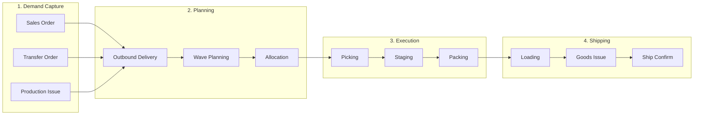
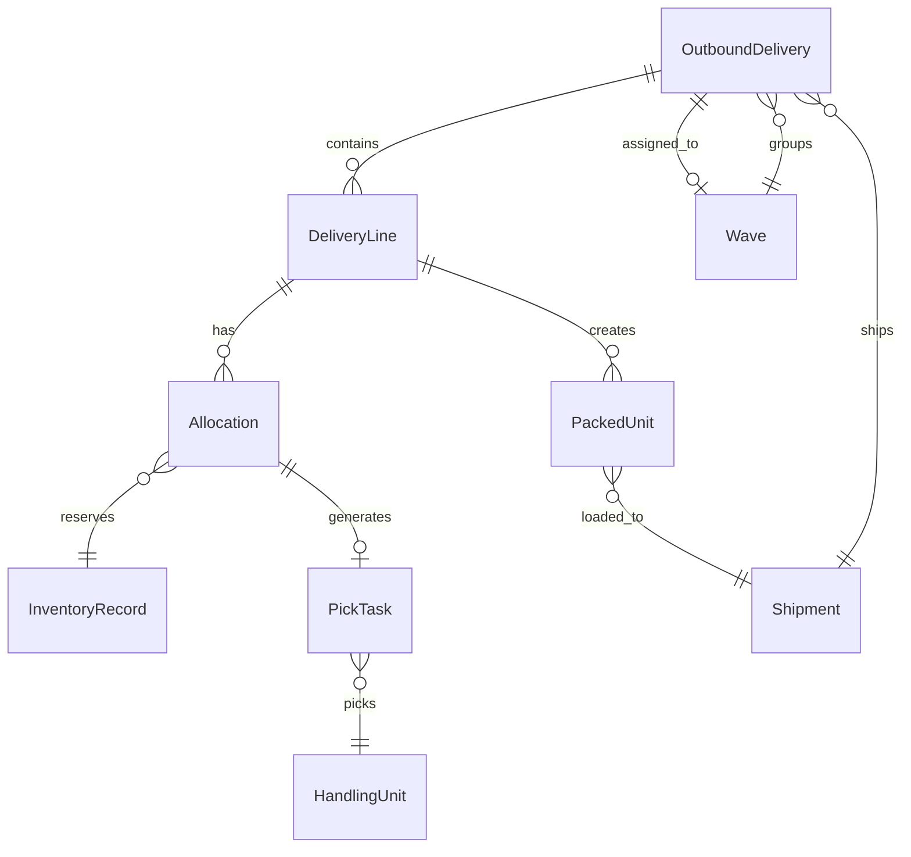
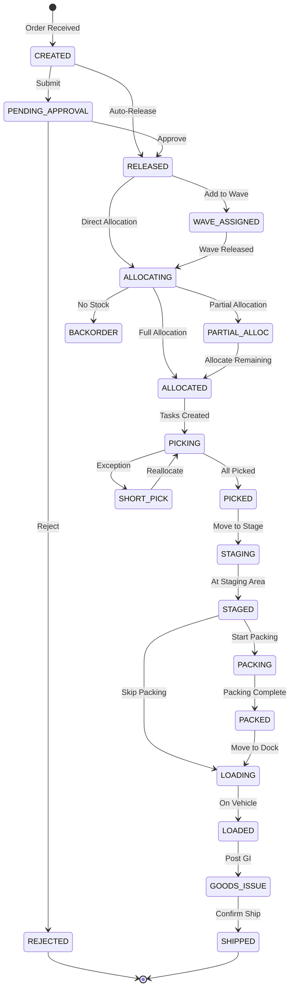
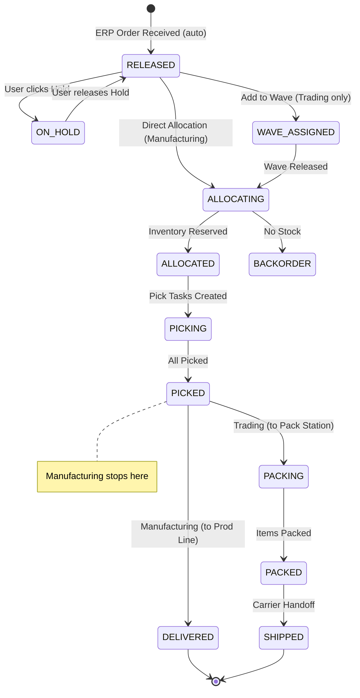

# Enterprise Outbound Module Design

> Based on SAP EWM, Manhattan Associates, Blue Yonder patterns  
> For Manufacturing (制造仓) + Trading/DC (商贸仓) contexts

---

## 1. Enterprise Outbound Workflow (The Standard)



### Key Stages Explained

| Stage | SAP EWM Term | Purpose | Your Current State |
|-------|--------------|---------|-------------------|
| **Demand Capture** | Sales Order / Delivery Request | Receive demand signal | ✅ OutboundOrderCreate |
| **Outbound Delivery (ODO)** | Outbound Delivery Order | Central warehouse document | ⚠️ Partial (DN_Workflow_DB) |
| **Wave Planning** | Wave Management | Group orders for efficiency | ❌ Missing |
| **Allocation** | Inventory Allocation | Reserve inventory FEFO/FIFO | ⚠️ Production only |
| **Picking** | Warehouse Task (Pick) | Physical retrieval | ⚠️ Basic implementation |
| **Staging** | Staging Area Management | Consolidate before pack | ❌ Missing |
| **Packing** | Packing Workstation | Create shipping units | ⚠️ Basic (DispatchPacking) |
| **Loading** | Transportation Integration | Load onto vehicle | ❌ Missing |
| **Goods Issue** | Goods Issue Posting | Inventory deduction | ⚠️ Implicit in Ship |
| **Ship Confirm** | Shipment Confirmation | Carrier handoff | ✅ ShipmentConfirmation |

---

## 2. Manufacturing vs Trading: Key Differences

### Manufacturing Warehouse (制造仓)

| Characteristic | Implication |
|----------------|-------------|
| **Demand source** | Production Orders, Internal Transfers, Subcontracting Shipments |
| **Order frequency** | Fewer, larger orders |
| **Picking unit** | Full pallets, IBCs, drums |
| **Batch/lot tracking** | Mandatory genealogy |
| **QC hold** | May require pre-ship inspection |
| **Typical flow** | FG Receipt → Storage → Production Issue Order → Pick → Stage at Dock → Ship |

### Trading/Distribution Center (商贸仓)

| Characteristic | Implication |
|----------------|-------------|
| **Demand source** | Many customer sales orders |
| **Order frequency** | High volume, small orders |
| **Picking unit** | Cases, eaches, split pallets |
| **Wave planning** | Critical for efficiency (group by carrier, route, ship date) |
| **Cartonization** | Calculate optimal box sizes |
| **Typical flow** | Order → Wave → Allocate → Pick → Pack → Ship |

### Your System Design Solution

Support **both** with a **context-aware workflow**:

```javascript
// In domain/outbound/OutboundOrderValidator.js
static ORDER_TYPE_CONFIG = {
  'SALES_ORDER': {
    requiresWavePlanning: true,
    requiresAllocation: true,
    requiresPacking: true,
    requiresCartonization: true,
    context: 'TRADING'
  },
  'TRANSFER_OUT': {
    requiresWavePlanning: false,
    requiresAllocation: true,
    requiresPacking: false, // Ship as-is
    requiresCartonization: false,
    context: 'MANUFACTURING'
  },
  'PRODUCTION_ISSUE': {
    requiresWavePlanning: false,
    requiresAllocation: true, // FEFO allocation
    requiresPacking: false,
    requiresCartonization: false,
    context: 'MANUFACTURING'
  }
};
```

---

## 3. Core Entities (Domain Model)

### 3.1 Entity Relationship



### 3.2 Entity Definitions

#### OutboundDelivery (Delivery Note / DN)

```javascript
{
  dn_no: "DN-2026-00123",           // Primary key
  type: "SALES_ORDER",              // SALES_ORDER | TRANSFER_OUT | PRODUCTION_ISSUE
  status: "ALLOCATED",              // See status machine
  
  // Header
  customer_code: "CUST-001",        // For SALES_ORDER
  destination_warehouse: "WH02",    // For TRANSFER_OUT
  production_order: "PO-001",       // For PRODUCTION_ISSUE
  
  ship_to_address: {...},
  requested_delivery_date: "2026-02-05",
  priority: "HIGH",                 // HIGH | NORMAL | LOW
  
  // Planning
  wave_id: "WAVE-001",              // Assigned wave
  route: "SH-ROUTE-01",
  carrier: "SF-EXPRESS",
  
  // Execution tracking
  allocated_at: timestamp,
  picked_at: timestamp,
  packed_at: timestamp,
  shipped_at: timestamp,
  
  // Lines
  lines: [DeliveryLine, ...]
}
```

#### DeliveryLine

```javascript
{
  line_no: 10,
  material_code: "ADH-001",
  material_desc: "Epoxy Adhesive",
  
  // Quantities
  ordered_qty: 100,
  allocated_qty: 100,
  picked_qty: 100,
  packed_qty: 100,
  shipped_qty: 100,
  
  uom: "KG",
  batch: "B-2026-001",              // If batch-managed
  serial_numbers: [],               // If serial-managed
  
  // Allocation result
  allocations: [Allocation, ...]
}
```

#### Wave

```javascript
{
  wave_id: "WAVE-2026-001",
  status: "IN_PROGRESS",            // PLANNED | RELEASED | IN_PROGRESS | COMPLETED
  
  // Grouping criteria
  ship_date: "2026-02-02",
  carrier: "SF-EXPRESS",
  route: "SH-ROUTE-01",
  
  // Deliveries in this wave
  delivery_count: 15,
  line_count: 45,
  
  // Planning
  created_at: timestamp,
  released_at: timestamp,
  pick_method: "BATCH",             // DISCRETE | BATCH | ZONE | CLUSTER
  
  // Progress
  picks_completed: 30,
  picks_total: 45
}
```

#### PickTask

```javascript
{
  task_id: "PICK-2026-00001",
  type: "OUTBOUND_PICK",
  status: "PENDING",                // PENDING | ASSIGNED | IN_PROGRESS | COMPLETED
  
  // What to pick
  dn_no: "DN-2026-00123",
  line_no: 10,
  material_code: "ADH-001",
  batch: "B-2026-001",
  
  // Where
  from_location: "ZONE-A-01-01",
  from_hu: "PLT-001",
  to_location: "STAGE-OUT-01",
  
  // How much
  qty: 100,
  uom: "KG",
  
  // Assignment
  assigned_to: "WKR-001",
  priority: 1,                      // Sequence order
  
  // Execution
  started_at: timestamp,
  completed_at: timestamp,
  picked_hu: "PLT-001"              // Actual picked HU
}
```

---

## 4. Status Machine (Enterprise Grade)



### Simplified Status Set (Recommended)

For your implementation, use a **subset**:

| Status | Meaning | UI Badge |
|--------|---------|----------|
| `CREATED` | New order, not released | Gray |
| `PENDING_APPROVAL` | Awaiting approval | Yellow |
| `RELEASED` | Approved, ready for planning | Blue |
| `ALLOCATED` | Inventory reserved | Cyan |
| `PICKING` | Pick tasks in progress | Orange |
| `PICKED` | All items picked | Purple |
| `PACKING` | At pack station | Pink |
| `PACKED` | Ready to load | Indigo |
| `LOADING` | Being loaded | Amber |
| `SHIPPED` | Dispatched | Green |
| `REJECTED` | Cancelled | Red |
| `BACKORDER` | No inventory | Gray |

---

## 5. Page Design (Enterprise UI)

### 5.1 Navigation Structure

```
/outbound
├── /orders                    # Order List (All DNs)
│   └── /:id                   # Order Detail
├── /create                    # Create New Order
├── /approval                  # Approval Queue (Manager)
├── /waves                     # Wave Management (Planner)
│   └── /:id                   # Wave Detail
├── /allocation                # Allocation Monitor (Planner)
├── /picking                   # Pick Task Queue (Operator)
├── /staging                   # Staging Area View
├── /packing                   # Packing Workstation (Operator)
├── /loading                   # Loading Dock View
├── /shipment                  # Shipment Confirmation
└── /exceptions                # Outbound Exceptions
```

### 5.2 Page Specifications

---

#### `/outbound/orders` - Outbound Order List

**Purpose**: Central view of all outbound deliveries

**Tabs**:
| Tab | Filter | Count Badge |
|-----|--------|-------------|
| All | None | Total |
| Pending Release | `status IN (CREATED, PENDING_APPROVAL)` | Count |
| Awaiting Allocation | `status = RELEASED` | Count |
| In Execution | `status IN (ALLOCATED, PICKING, PICKED, PACKING)` | Count |
| Ready to Ship | `status IN (PACKED, LOADING)` | Count |
| Shipped | `status = SHIPPED` | Count |
| Exceptions | Has active exception | Count |

**Filters**:
- Date range (created, requested delivery)
- Customer
- Carrier
- Order type (Sales, Transfer, Production Issue)
- Priority
- Wave

**Columns**:
| Column | Description |
|--------|-------------|
| DN # | Click to detail |
| Type | Icon + label |
| Customer/Dest | Customer name or destination WH |
| Lines | Line count |
| Status | Badge with color |
| Priority | HIGH/NORMAL/LOW |
| Wave | Wave ID if assigned |
| Req. Date | Requested delivery date |
| Progress | Progress bar (allocated/picked/packed qty) |

**Actions**:
| Action | Condition | Role |
|--------|-----------|------|
| Create Order | Always | Planner |
| Bulk Approve | Selected orders in PENDING | Manager |
| Add to Wave | Selected orders in RELEASED | Planner |
| Release Wave | Wave selected | Planner |

---

#### `/outbound/waves` - Wave Management (NEW PAGE)

**Purpose**: Plan and release waves for efficient picking

**Tabs**:
| Tab | Filter |
|-----|--------|
| Open Waves | `status = PLANNED` |
| Released | `status = RELEASED` |
| In Progress | `status = IN_PROGRESS` |
| Completed | `status = COMPLETED` |

**Wave Card Layout**:
```
┌─────────────────────────────────────────────────────────┐
│ WAVE-2026-001                              [PLANNED]    │
├─────────────────────────────────────────────────────────┤
│ Ship Date: 2026-02-02    Carrier: SF-EXPRESS            │
│ Route: Shanghai North                                   │
│ Orders: 15    Lines: 45    Picks: 0/45                  │
│ ▓▓▓░░░░░░░░░░░░░░░░░░░░░░ 0%                            │
├─────────────────────────────────────────────────────────┤
│ [View Orders]  [Edit Wave]  [Release Wave]              │
└─────────────────────────────────────────────────────────┘
```

**Create Wave Dialog**:
- Pick method: Discrete / Batch / Zone
- Grouping: By Carrier / By Route / By Ship Date
- Auto-include orders matching criteria

---

#### `/outbound/picking` - Pick Task Queue (ENHANCED)

**Purpose**: Operator view for executing pick tasks

**View Modes**:
1. **Task List** - Individual tasks sorted by priority
2. **Wave View** - Tasks grouped by wave
3. **Location View** - Tasks grouped by source location (for zone picking)

**Task Card**:
```
┌─────────────────────────────────────────────────────────┐
│ PICK-001                                    [PENDING]   │
│ Priority: 1                                 Wave: W-001 │
├─────────────────────────────────────────────────────────┤
│ Material: ADH-001 - Epoxy Adhesive                      │
│ Batch: B-2026-001        Qty: 100 KG                    │
│                                                         │
│ From: ZONE-A-01-01 (Aisle A, Rack 01, Level 01)        │
│ To: STAGE-OUT-01                                        │
├─────────────────────────────────────────────────────────┤
│ [Start Pick]                                            │
└─────────────────────────────────────────────────────────┘
```

**Pick Execution Flow**:
1. Select task → Start Pick
2. Confirm location (scan)
3. Confirm HU/batch (scan)
4. Enter picked qty
5. Report short pick if needed
6. Confirm → Task complete

---

#### `/outbound/staging` - Staging Area Monitor (NEW PAGE)

**Purpose**: Track items in staging area before pack/load

**Layout**: Kanban or Zone Grid

```
┌─────────────────────────────────────────────────────────────────────┐
│ STAGING AREA MONITOR                                                │
├──────────────────┬──────────────────┬──────────────────────────────┤
│ STAGE-OUT-01     │ STAGE-OUT-02     │ STAGE-OUT-03                 │
│ ────────────     │ ────────────     │ ────────────                 │
│ DN-001 (3 items) │ DN-005 (1 item)  │ (Empty)                      │
│ DN-002 (2 items) │ DN-006 (5 items) │                              │
│ DN-003 (1 item)  │                  │                              │
│                  │                  │                              │
│ [6 items staged] │ [6 items staged] │ [Available]                  │
└──────────────────┴──────────────────┴──────────────────────────────┘
```

---

#### `/outbound/packing` - Packing Workstation (ENHANCED)

**Purpose**: Pack items into shipping units

**Workflow**:
1. Scan staged HU or select DN
2. System suggests carton size
3. Scan items into carton
4. Capture weight
5. Print shipping label
6. Close carton → Next

**Pack Screen Layout**:
```
┌────────────────────────────────────────────────────────────────────┐
│ PACKING WORKSTATION                                                │
├─────────────────────────────────┬──────────────────────────────────┤
│ CURRENT ORDER: DN-2026-00123    │ CARTON: CTN-001 (30x20x15 cm)    │
│ Customer: TESLA                 │ Target Weight: 5 KG              │
│                                 │ Current Weight: 3.2 KG           │
├─────────────────────────────────┼──────────────────────────────────┤
│ TO PACK:                        │ IN CARTON:                       │
│ □ ADH-001 x 2 KG               │ ✓ ADH-001 x 1 KG                 │
│ □ CAT-001 x 1 KG               │ ✓ ADH-001 x 1 KG                 │
│ □ SOL-001 x 2 L                │                                  │
│                                 │                                  │
├─────────────────────────────────┴──────────────────────────────────┤
│ [Scan Item]                          [Close Carton]  [Print Label] │
└────────────────────────────────────────────────────────────────────┘
```

---

#### `/outbound/loading` - Loading Dock (NEW PAGE)

**Purpose**: Load packed goods onto vehicle

**Dock View**:
```
┌─────────────────────────────────────────────────────────────────────┐
│ LOADING DOCKS                                                       │
├──────────────────┬──────────────────┬───────────────────────────────┤
│ DOCK-01          │ DOCK-02          │ DOCK-03                       │
│ ────────────     │ ────────────     │ ────────────                  │
│ Carrier: SF      │ Carrier: ZTO     │ (Available)                   │
│ Vehicle: 沪A1234 │ Vehicle: 苏B5678 │                               │
│ Status: LOADING  │ Status: WAITING  │                               │
│                  │                  │                               │
│ Shipments: 5     │ Shipments: 3     │                               │
│ Loaded: 3/5      │ Loaded: 0/3      │                               │
│ ▓▓▓▓▓▓░░░░ 60%   │ ░░░░░░░░░░ 0%    │                               │
│                  │                  │                               │
│ [Load Next]      │ [Start Loading]  │ [Assign Carrier]              │
└──────────────────┴──────────────────┴───────────────────────────────┘
```

---

## 6. Implementation Roadmap

### Phase 1: Foundation (Week 1-2)

**Goal**: Enhance domain model and validators

| Task | Files | Priority |
|------|-------|----------|
| Update OutboundOrderValidator with new statuses | `src/domain/outbound/OutboundOrderValidator.js` | P0 |
| Add Wave entity and WaveService | `src/domain/outbound/WaveService.js` (new) | P0 |
| Add Allocation entity | `src/domain/outbound/AllocationService.js` (new) | P0 |
| Update WORKFLOWS.md | `docs/WORKFLOWS.md` | P1 |
| Update DOMAIN_MODEL.md | `docs/DOMAIN_MODEL.md` | P1 |

### Phase 2: Wave Planning (Week 2-3)

**Goal**: Add wave management UI and backend

| Task | Files | Priority |
|------|-------|----------|
| Create Waves page | `src/modules/outbound/pages/Waves.jsx` (new) | P0 |
| Create WaveDetail page | `src/modules/outbound/pages/WaveDetail.jsx` (new) | P1 |
| Add Wave Node-RED handlers | Node-RED: Wave group | P0 |
| Add wave assignment to order list | `src/modules/outbound/pages/OutboundOrders.jsx` | P1 |

### Phase 3: Allocation Engine (Week 3-4)

**Goal**: Implement proper outbound allocation

| Task | Files | Priority |
|------|-------|----------|
| Create allocation logic (reuse from Production FEFO) | Node-RED: Allocation Engine | P0 |
| Add allocation status to orders | Update Order normalizer | P1 |
| Add Allocation page | `src/modules/outbound/pages/AllocationMonitor.jsx` (new) | P2 |

### Phase 4: Enhanced Picking (Week 4-5)

**Goal**: Task-based picking with staging

| Task | Files | Priority |
|------|-------|----------|
| Enhance PickingTask page | `src/modules/outbound/pages/PickingTask.jsx` | P0 |
| Add outbound pick confirmation | Node-RED | P0 |
| Create Staging page | `src/modules/outbound/pages/Staging.jsx` (new) | P1 |

### Phase 5: Packing & Loading (Week 5-6)

**Goal**: Complete ship prep workflow

| Task | Files | Priority |
|------|-------|----------|
| Enhance Packing page | `src/modules/outbound/pages/DispatchPacking.jsx` | P0 |
| Create Loading page | `src/modules/outbound/pages/Loading.jsx` (new) | P1 |
| Add Goods Issue logic | Node-RED | P0 |

---

## 7. Where to Start

### Step 1: Update Domain Validator

Open `src/domain/outbound/OutboundOrderValidator.js` and add:

```javascript
static VALID_STATUSES = [
  'CREATED',
  'PENDING_APPROVAL',
  'RELEASED',
  'ALLOCATED',
  'PICKING',
  'PICKED',
  'PACKING',
  'PACKED',
  'LOADING',
  'SHIPPED',
  'REJECTED',
  'BACKORDER'
];

static VALID_TRANSITIONS = {
  'CREATED': ['PENDING_APPROVAL', 'RELEASED'],
  'PENDING_APPROVAL': ['RELEASED', 'REJECTED'],
  'RELEASED': ['ALLOCATED', 'BACKORDER'],
  'ALLOCATED': ['PICKING'],
  'PICKING': ['PICKED'],
  'PICKED': ['PACKING', 'LOADING'],  // Skip packing for manufacturing
  'PACKING': ['PACKED'],
  'PACKED': ['LOADING'],
  'LOADING': ['SHIPPED'],
  'SHIPPED': [],
  'REJECTED': [],
  'BACKORDER': ['RELEASED']
};
```

### Step 2: Create Wave Service

Create `src/domain/outbound/WaveService.js`:

```javascript
export class WaveService {
  static WAVE_STATUSES = ['PLANNED', 'RELEASED', 'IN_PROGRESS', 'COMPLETED'];
  
  static buildCreateWaveCommand(waveData) {
    return {
      wave_id: 'WAVE-' + Date.now(),
      ship_date: waveData.shipDate,
      carrier: waveData.carrier,
      pick_method: waveData.pickMethod || 'BATCH',
      status: 'PLANNED',
      delivery_ids: waveData.deliveryIds || [],
      created_at: Date.now()
    };
  }
  
  static buildReleaseWaveCommand(waveId) {
    return {
      wave_id: waveId,
      action: 'RELEASE',
      timestamp: Date.now()
    };
  }
}
```

### Step 3: Add Node-RED Wave Handler

In Node-RED, create group "Outbound: Wave Management":

1. **MQTT In**: `Henkelv2/Shanghai/Logistics/Outbound/Action/Create_Wave`
2. **Function**: Create wave, save to `global.get('wave_db')`
3. **MQTT Out**: `Henkelv2/Shanghai/Logistics/Outbound/State/Wave_List`

---

## 8. Design Decisions (Confirmed)

| Decision | Choice | Rationale |
|----------|--------|-----------|
| **Approval** | Auto-approve all + Manual Hold toggle | ERP sent valid order. Human clicks "Hold" if problem detected. |
| **Wave Planning** | Split: Trading=Waves, Manufacturing=Direct | DC needs grouping for efficiency. Plant needs immediate release. |
| **Manufacturing Packing** | Pick-to-Location (no pack) | Production line = "customer address". Move Item A → Line B. Done. |
| **3PL Control** | Virtual Location | Stock at 3PL disappears from detailed control. Track "Total Qty at 3PL" only. |
| **Pick Method** | User-Directed (List View) | Show 10 items. User decides walk path. Trust human > complex algorithms. |

---

## 9. Simplified Status Machine (Based on Decisions)



**Key simplification**: 
- No `PENDING_APPROVAL` - everything auto-releases
- `ON_HOLD` is manual exception
- Manufacturing path: PICKING → PICKED → DELIVERED (skip packing)
- Trading path: PICKING → PICKED → PACKING → PACKED → SHIPPED

---

## References

- [SAP EWM Outbound Process](https://sapewmhelp.com)
- [Manhattan Active WM](https://manh.com)
- [Blue Yonder WMS](https://warehouse-logistics.com)
- Your existing: `docs/WORKFLOWS.md`, `docs/UI_PAGES.md`
